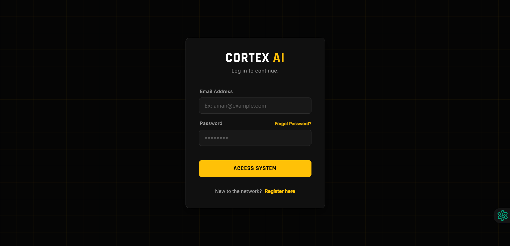
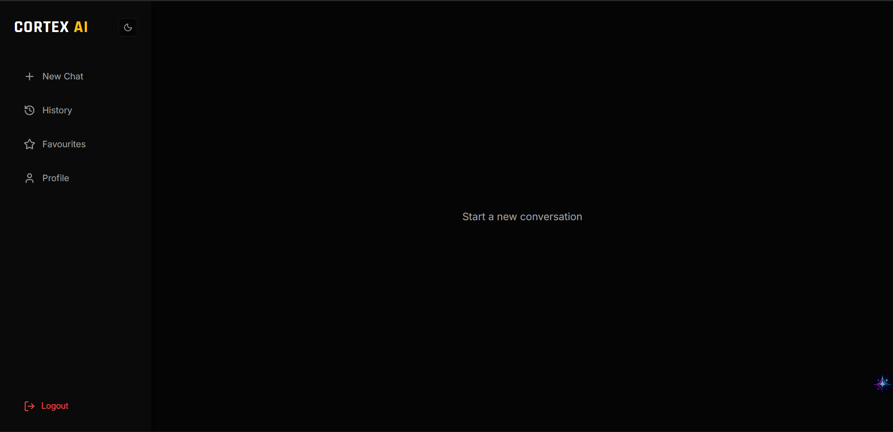
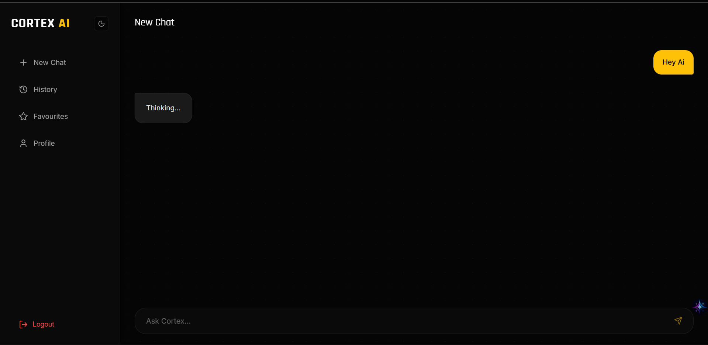
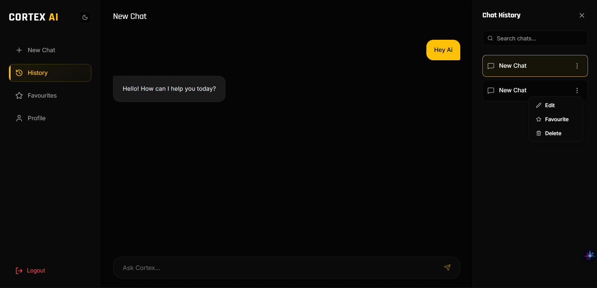

#  Cortex AI - Intelligent Chat Ecosystem


**Cortex AI** is a next-generation chat application designed to mimic human-like memory. Unlike traditional chatbots that forget context once a session ends, Cortex utilizes **Retrieval Augmented Generation (RAG)** to retain long-term context across different conversations, making it your true digital "Second Brain."
## 📸 Project Screenshots

### Authentication


### Chat Interface


### RealtimeChat


### ChatHistory

---

## 📂 Project Architecture

The project is divided into two distinct parts:

```bash
Cortex-AI/
├── backend/         
└── frontend/        


## 🛡️ Backend (The Brain)

The backend is the powerhouse of Cortex AI. It handles real-time communication, manages vector embeddings for memory, and connects with high-performance LLMs.

🛠️ Backend Tech Stack

Node.js
Express.js
MongoDB
Socket.IO
JWT Authentication
Pinecone (Vector Database)
Groq (LLaMA 3)
Xenova (Local Embeddings)

### 📂 Backend Folder Structure

```bash
backend/
├─ src/
│  ├─ controllers/        # Request handlers
│  │  ├─ auth.controller.js
│  │  └─ chat.controller.js
│  ├─ db/                 # Database connection
│  │  └─ db.js
│  ├─ middleware/         # Auth & security middleware
│  │  └─ auth.middleware.js
│  ├─ models/             # Mongoose schemas
│  │  ├─ chat.model.js
│  │  ├─ message.model.js
│  │  └─ user.model.js
│  ├─ routes/             # API routes
│  │  ├─ auth.route.js
│  │  └─ chat.routes.js
│  ├─ services/           # AI & Vector logic
│  │  ├─ ai.service.js
│  │  └─ vector.service.js
│  ├─ sockets/            # Real-time socket server
│  │  └─ socket.server.js
│  └─ app.js              # Express app config
├─ .env
├─ .gitignore
├─ flow.excalidraw        # Architecture / flow diagram
├─ package.json
├─ package-lock.json
└─ server.js              # App entry point


## 🎨 Frontend – The Interface
The frontend provides a clean, responsive, and chat-focused UI, inspired by modern AI chat platforms like ChatGPT.

🛠️ Frontend Tech Stack

React (Vite)
SCSS (Modular Architecture)
Socket.IO Client
REST API Integration
Modern Component-based UI

### 📂 Frontend Folder Structure
frontend/
├─ public/
│  └─ vite.svg
├─ src/
│  ├─ components/
│  │  └─ chat/
│  │     ├─ ChatComponents.scss
│  │     ├─ ChatComponents.css
│  │     ├─ ChatComponents.css.map
│  │     ├─ ChatListPanel.jsx
│  │     ├─ ChatWindow.jsx
│  │     ├─ ProfilePanel.jsx
│  │     └─ Sidebar.jsx
│  ├─ pages/
│  │  ├─ ChatInterface.jsx
│  │  ├─ Login.jsx
│  │  ├─ Register.jsx
│  │  ├─ ForgotPassword.jsx
│  │  ├─ Login.scss
│  │  ├─ Register.scss
│  │  └─ ForgotPassword.scss
│  ├─ services/
│  │  ├─ api.js           # REST API calls
│  │  └─ socket.js        # Socket.IO client
│  ├─ styles/
│  │  ├─ abstracts/
│  │  │  ├─ _variables.scss
│  │  │  └─ _mixins.scss
│  │  ├─ global.scss
│  │  ├─ global.css
│  │  └─ global.css.map
│  ├─ App.jsx
│  └─ main.jsx
├─ index.html
├─ vite.config.js
├─ eslint.config.js
├─ package.json
├─ package-lock.json
└─ README.md


